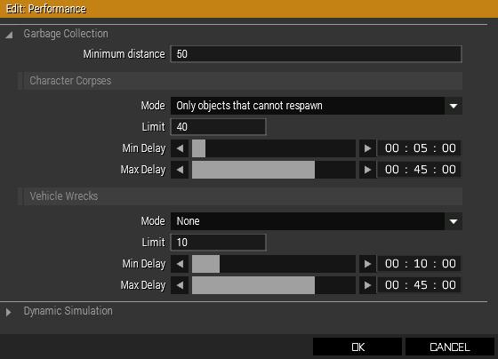

# Garbage Collection: Why and How to use it


Arma 3 has a built-in garbage collector that must be enabled before it can be used. The garbage collector will delete corpses under certain conditions, such as while players are a certain distance away from a corpse and there are too many dead bodies in the mission.

The system is easily configured - and, importantly, easily disabled. 

## Easy Configuration & Suggested Settings
The following documentation is intended for those that prefer to use Eden's internal configuration dialogue. It is available in the `Attributes` menu under the `Performance` entry.

<p align="center">
  
</p>

### Minimum Distance

A minimum distance of 50 may be too long for some very dense missions, but in normal play, ensures that bodies will not be observed vanishing too easily. Reduce this as low as 0, which means "no limit". Be advised that the same distance applies to both infantry and wrecks if you configure the collector to deal with wrecks.

### Character Corpses

The recommended `Mode` is "objects that cannot respawn" to avoid any possible issues with respawning players or other vehicles.

The suggested `Limit` needs investigation and tweaking: 20-40 seems fine for now. Lower is better for missions that already have performance issues. Corpses are deleted as configured, but note that the limit must be *exceeded*, not *equaled*, to switch modes.

The Minimum delay determines how long before a dead body is removed when the number of dead bodies EXCEEDS the limit - in other words, this timer is completely seperate from when the corpse actually dies.

For a timer based on death, you want "Max Delay" - this counts from the time of the corpse dying, and will delete the corpse regardless of whether or not the limit is reached.

### Vehicle Wrecks

Vehicles are handled identically to corpses - after all, men are simply vehicles, in this engine. I personally intend to leave this setting off, because wrecks disappearing are much more noticable than corpses.

## Configuration through description.ext

The documentation to configure using description.ext is available on [the Bohemia Interactive Wiki](https://community.bistudio.com/wiki/Description.ext#Corpse_.26_Wreck_Management). It provides many ways for us to have the garbage collection system on by default if these options are added to the template, but I would be careful about doing so - new architects will have more to learn before making their first op. This section will be expanded upon request, though anyone advanced enough to be doing this should have little difficulty interpreting the wiki.

## Selectively Disabling the system

The garbage collector may be disabled on a per-unit basis very easily. 
Simply add `removeFromRemainsCollector [this];` into the important unit's init field in the editor, or `removeFromRemainsCollector [_this];` if using the command in Zeus mode. I am not sure why you would need the latter, but it's important to keep in mind ZEN's additional underscore before it. If you are placing this on a unit that is meant to be *already* dead at mission start, you should put this line such that it executes before the unit is killed with a script in the init field instead of using the "Health/Armor" slider, like so:
```sqf
removeFromRemainsCollector [this];
this spawn {sleep 3; _this setDamage 1;}
```

Reportedly, garbage collection can be an issue if the unit "dies" before the game actually starts, resulting in instant removal of an otherwise convincing setpiece.